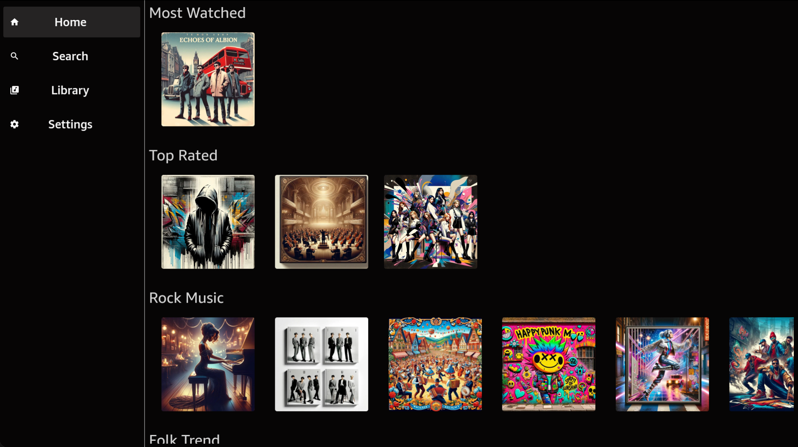

Vega Audio Sample App
==============================================

The Vega Audio Sample App demonstrates how to implement audio playback functionality in Vega applications. This feature-focused sample app serves as a practical guide for developers building audio-centric TV apps.



Introduction
------------

Key features include:

- **Dynamic home interface** with album carousels and TV-optimized navigation.
- **Album detail pages** featuring track listings and metadata presentation.
- **Audio playback** using W3C Media API with preview functionality.
- **TV-optimized navigation** with focus management and remote control support.
- **Standard audio controls** including play/pause, track navigation, and time-based seeking.
- **Background audio handling** with proper app state management.


Build and run the app
--------------------

### Prerequisites

Before you launch the sample app, make sure that you have [installed the Vega Developer Tools](https://developer.amazon.com/docs/vega/0.21/install-vega-sdk.html).

### Step 1: Build the app

After you download the source code from GitHub, you can build the Vega Audio Sample App from the command line to generate VPKG files. The VPKG files run on the Vega Virtual Device and Vega OS Fire TV Stick.

You can also use [Vega Studio](https://developer.amazon.com/docs/vega/0.21/setup-extension.html#learn-the-basic-features) with Visual Studio Code to build the app.

1. At the command prompt, navigate to the Vega Audio Sample App source code directory.

2. To install the app dependencies, run the following command.

   ```bash
   npm install
   ```

3. To build the app to generate .vpkg files, run the following command.

   ```bash
   npm run build:app
   ```

4. At the command prompt, in the **build** folder, verify that you generated the VPKG files for your device's architecture.

   * **armv7-release/kepleraudioreferenceapp_armv7.vpkg**—generated on x86_64 and Mac-M series devices to run on the Vega OS Fire TV Stick.
   * **x86_64-release/kepleraudioreferenceapp_x86_64.vpkg**—generated on x86_64 device to run on the VVD.
   * **aarch64-release/kepleraudioreferenceapp_aarch64.vpkg**—generated on Mac M-series device to run on the VVD.

### Step 2: Run the app

#### Vega Virtual Device

1. To start the Vega Virtual Device, at the command prompt, run the following command.

   ```bash
   kepler virtual-device start
   ```

2. Go to the directory where you placed the VPKG files.

3. To install and launch the app on the Vega Virtual Device, run the following command, depending on your device architecture.

   - On Mac M-series based devices.
      
      ```bash
      kepler run-kepler build/aarch64-release/kepleraudioreferenceapp_aarch64.vpkg
      ```

   - On x86_64 based devices.
      
     ```bash
     kepler run-kepler build/x86_64-release/kepleraudioreferenceapp_x86_64.vpkg
     ```

#### Vega OS Fire TV Stick

1. Turn on your Vega OS Fire TV Stick.

2. To install and launch the app on your Vega OS Fire TV Stick, run the following command.

   ```bash
   kepler run-kepler build/armv7-release/kepleraudioreferenceapp_armv7.vpkg
   ```

Troubleshooting the app
-----------------------

If you're facing unexpected issues while trying to build and run the app (For example, the build is failing randomly, the app is not starting, or the app is crashing randomly.) try the following solutions:

* Run the `npm run clean` command. This removes the `node_modules` folder and other files related to your previous builds.

* When working in debug mode, you might need to use `npm run start -- --reset-cache` to clear the cache.

* In some cases (For example, changes done to patches or changes in the package.json file.) you may need to make sure there is no cache present in the project, in order to build successfully. Cleaning ALL cache files in the project can be done by running the following commands:

```
npm run clean
npm cache clean --force
watchman watch-del-all
rm -fr $TMPDIR/haste-map-*
rm -rf $TMPDIR/metro-cache

npm install
npm start -- --reset-cache
```

* Restart the simulator.

* Run the `kepler clean` command. This removes the artifacts generated in the top level `/.build` folder. To learn more, see the [Vega CLI Functions](https://developer.amazon.com/docs/vega/0.21/cli-tools.html) document.

Testing the app
---------------

To run the test suite, use the following commands:

```
npm test
```

Run tests in watch mode:

```
npm run test:watch
```

Advanced features
-----------------

### W3C Media API Integration

This app uses Vega's W3C Media API (`@amazon-devices/react-native-w3cmedia`) for audio playback and demonstrates:

- **Audio preview system** with focus-based playback.
- **Background audio handling** with proper app state management.
- **Custom audio controls** with TV remote integration.

**For comprehensive W3C Media API documentation:**

- [Media Player Overview](https://developer.amazon.com/docs/vega/0.21/media-player.html) - Complete API reference and concepts.
- [Media Player Setup Guide](https://developer.amazon.com/docs/vega/0.21/media-player-setup.html) - Step-by-step implementation instructions.

### Focus management

Focus management is critical for TV applications. This app implements:

- **Initial focus** specification using `hasTVPreferredFocus`.
- **Focus-based audio preview** with 1-second delay and 10-second timeout.
- **TV-optimized navigation** patterns for album browsing.

### Audio preview system

The app features a TV-optimized preview system:
- 1-second delay before starting preview (prevents conflicts during rapid navigation).
- 10-second maximum preview duration.
- Automatic cleanup when screen loses focus.
- Background audio handling per TV platform guidelines.

### AudioPlayer and hooks usage

This app demonstrates comprehensive audio management through custom hooks and context providers.

#### useAudioHandler hook

The core audio management hook provides complete playback control:

```typescript
import { useAudioHandler } from '../utils/AudioHandler';
import React, { useCallback, useEffect, useState } from 'react';

const MyComponent = () => {
  const [progress, setProgress] = useState(0);
  
  const onLoadedMetadata = useCallback(() => {
    console.log('Audio ready');
  }, []);
  
  const { 
    audioRef, 
    initializePlayerInstance, 
    destroyAudioElements,
    isLoading,
    isBuffering 
  } = useAudioHandler({
    onTimeChange: setProgress,
    onLoadedMetadata,
  });

  // Initialize audio with track data.
  const playTrack = (trackInfo, albumThumbnail) => {
    initializePlayerInstance(trackInfo, albumThumbnail);
  };

  // Cleanup on unmount.
  useEffect(() => {
    return () => destroyAudioElements();
  }, []);
};
```

#### AudioProvider context

Global audio state management for cross-component synchronization:

```typescript
import React, { useContext } from 'react';
import { AudioProvider, AudioContext } from '../store/AudioProvider';

// Wrap your app.
<AudioProvider>
  <YourApp />
</AudioProvider>

// Access in components.
const { isAudioStarted, audioThumbnail, setIsAudioStarted } = useContext(AudioContext);
```

#### Key features

- **Multi-format support**: Automatic detection between MP3/MP4 (AudioPlayer) and DASH/HLS (ShakaPlayer).
- **Race condition prevention**: Prevents concurrent initialization during rapid track changes.
- **Vega Media Controls**: TV remote integration for play/pause/seek operations.
- **Memory management**: Automatic cleanup and resource management.
- **Debounced seeking**: Prevents audio glitches during rapid seek operations.

#### Usage patterns

**Basic Playback:**
```typescript
const trackInfo = {
  id: 1,
  title: 'Track Title',
  description: 'Track Description',
  duration: '3:45',
  type: 'mp3',
  audioURL: 'https://example.com/track.mp3',
  thumbURL: 'https://example.com/thumb.jpg'
};

const albumThumbnail = 'https://example.com/album-thumb.jpg';
initializePlayerInstance(trackInfo, albumThumbnail);
```

**Track Navigation:**
```typescript
const handleNext = (nextTrackInfo) => {
  onNextPreviousClick(nextTrackInfo);
};
```

**Cleanup:**
```typescript
useEffect(() => {
  return () => destroyAudioElements();
}, []);
```

Implementation guide
-------------------

### Audio architecture overview

The app uses a layered architecture for audio management:

- **AudioProvider**: Global state management using React Context.
- **useAudioHandler**: Core audio logic and player management.
- **W3C Media API**: Low-level audio playback via AudioPlayer/ShakaPlayer.
- **Vega Media Controls**: TV remote integration.

### Adding audio to your components

1. Setup AudioProvider

Example:
```typescript
import { AudioProvider } from './store/AudioProvider';

function App() {
  return (
    <AudioProvider>
      <YourComponents />
    </AudioProvider>
  );
}
```

2. Use the audio hook

Example:
```typescript
import { useAudioHandler } from './utils/AudioHandler';
import React, { useCallback, useState } from 'react';

const MyAudioComponent = () => {
  const [currentTime, setCurrentTime] = useState(0);
  const [ready, setReady] = useState(false);
  
  const onLoadedMetadata = useCallback(() => {
    setReady(true);
  }, []);
  
  const { initializePlayerInstance, audioRef } = useAudioHandler({
    onTimeChange: setCurrentTime,
    onLoadedMetadata,
  });

  const playAudio = () => {
    if (audioRef.current) {
      audioRef.current.play();
    }
  };
};
```

3. Handle the track data

Example:
```typescript
const trackData = {
  id: 1,
  title: 'Track Title',
  description: 'Track Description',
  duration: '3:45',
  type: 'mp3', // or 'mp4', 'dash', 'hls'
  audioURL: 'your-audio-url',
  thumbURL: 'thumbnail-url'
};

const albumThumbnail = 'album-thumbnail-url';
initializePlayerInstance(trackData, albumThumbnail);
```

Third-party library integration
------------------------------

This section provides the minimum integration steps necessary to integrate the third-party libraries with the sample app.

### TVFocusGuideView

`TVFocusGuide` helps you to write intuitive TV apps. It supports `autofocus` that helps in finding the focus, as well as remembering the focus on multiple visits. It also supports `trapping` and `focus redirection` which allow you to customize the focus behavior in your app.

To implement `TVFocusGuideView`:
1. Add the following package dependency in your [package.json](./package.json) file.
```typescript
  "dependencies": {
    ...
    "@amazon-devices/react-native-kepler": "~2.0.0"
  }
```
2. Reinstall the dependencies using `npm install`.

3. Import the corresponding `TVFocusGuideView` component.
```typescript
  import { TVFocusGuideView } from '@amazon-devices/react-native-kepler';
```

4. In the render block of your app, add the imported component.
```typescript
  <View>
    <TVFocusGuideView>
      <Text>Hello World</Text>
    </TVFocusGuideView>
  </View>
```

For more details about this vega supported library, see [TVFocusGuideView](https://developer.amazon.com/docs/vega-api/0.21/tvfocusguideview.html) in the Vega documentation.

Release Notes
-------------

### v0.21

- Initial release.

License
-------------
This project is licensed under the MIT-0 License - see the [LICENSE](LICENSE) file for details.